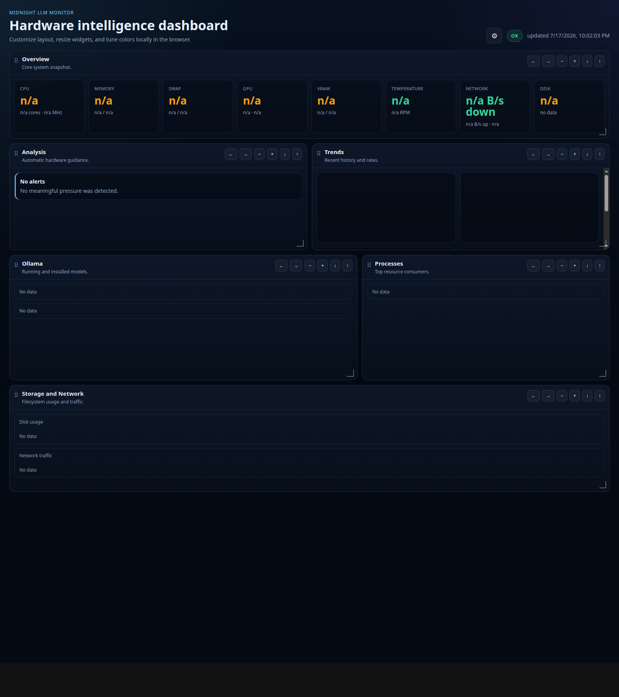
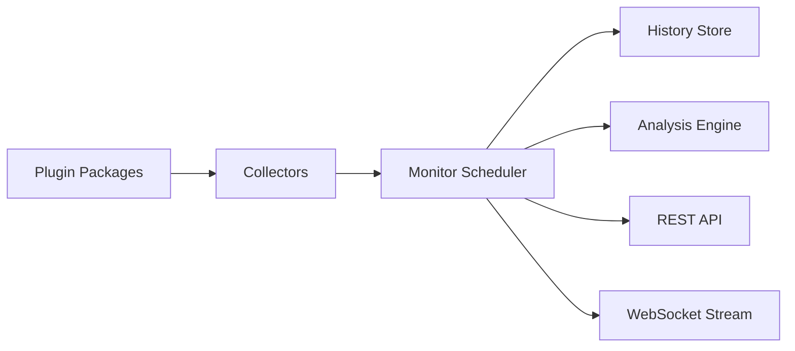

# Midnight LLM Monitor

Midnight LLM Monitor is a lightweight hardware intelligence daemon for machines running local LLM servers such as Ollama, llama.cpp, and vLLM-adjacent tooling.

It exposes live metrics over REST and WebSocket so Midnight Coder can make decisions from real hardware state instead of guesses.

## Current focus

- GPU and VRAM visibility in the overview
- Ollama running model CPU/GPU split, context usage, and model metadata
- llama.cpp process discovery and model path/context hints
- low-overhead polling with cached expensive collectors
- plugin discovery for third-party collectors

## Install

Requires Node.js 20 or newer.

```bash
npm install -g midnight-monitor
```

Run without installing:

```bash
npx midnight-monitor
```

## Access

Start the daemon and open the dashboard in a browser:

```bash
midnight-monitor start
```

Then visit:

- `http://127.0.0.1:9898/` when the monitor runs on your own machine
- `http://<server-ip>:9898/` when the monitor runs on another host

The default HTTP port is `9898`. If you change it in `midnight-monitor.config.json`, use that port instead.

## CLI

```bash
midnight-monitor
midnight-monitor start
midnight-monitor stop
midnight-monitor status
midnight-monitor doctor
midnight-monitor benchmark
```

`midnight-monitor` without arguments prints help. Use `midnight-monitor start` to start the daemon.

## Release

Releases are published from GitHub Actions, not from a local `npm publish`.

Prerequisites:

- GitHub repository secret `NPM_TOKEN` must contain an npm automation token with publish access to `midnight-monitor`.
- Commits merged to `main` must use Conventional Commits so `semantic-release` can decide the next version.

Publish flow:

```bash
npm run typecheck
npm run lint
npm test
npm run build
git push origin main
```

The `Release` workflow runs `npx semantic-release`, creates the GitHub release, and publishes the package to npm.

## Configuration

Create `midnight-monitor.config.json` in the working directory.

```json
{
  "server": {
    "host": "127.0.0.1",
    "port": 9898,
    "wsPath": "/ws"
  },
  "collectors": {
    "enabled": [
      "cpu",
      "ram",
      "swap",
      "gpu",
      "disk",
      "network",
      "temperatures",
      "processes",
      "ollama",
      "llamacpp",
      "history"
    ],
    "modules": []
  },
  "intervals": {
    "cpu": 1000,
    "ram": 1000,
    "swap": 1000,
    "gpu": 1000,
    "disk": 10000,
    "temperatures": 5000,
    "network": 1000,
    "processes": 1000,
    "ollama": 2000,
    "llamacpp": 2000,
    "history": 1000
  }
}
```

## REST API

- `GET /` dashboard web
- `GET /health`
- `GET /metrics`
- `GET /cpu`
- `GET /memory`
- `GET /swap`
- `GET /gpu`
- `GET /disk`
- `GET /network`
- `GET /ollama`
- `GET /history`
- `GET /processes`

Example:

```bash
curl http://127.0.0.1:9898/metrics
```

## WebSocket

Connect to `/ws` for live updates.

```js
const socket = new WebSocket("ws://127.0.0.1:9898/ws");
socket.onmessage = (event) => {
  console.log(JSON.parse(event.data));
};
```

## Web Monitor

Open `http://127.0.0.1:9898/` to see the visual monitor with:

- a GPU/VRAM-first overview for quick capacity checks
- live CPU, RAM, swap, disk, network, and temperature cards
- Ollama running models with CPU %, GPU %, context, context limit, and size
- installed Ollama models with architecture and quantization
- llama.cpp process detection with model path and context hints
- top resource-consuming processes
- history charts for recent pressure and speed changes
- a gear menu for appearance settings
- restore defaults for theme and layout
- draggable and resizable widgets
- warning, critical, and info analysis badges



## Example payload

```json
{
  "timestamp": "2026-07-17T12:00:00.000Z",
  "cpu": { "usage": 32, "cores": 8, "threads": 16, "frequencyMhz": 4300 },
  "ram": {
    "usedBytes": 123456789,
    "totalBytes": 17179869184,
    "usagePercent": 41.2
  },
  "swap": { "usedBytes": 0, "totalBytes": 34359738368, "usagePercent": 0 },
  "gpu": {
    "vendor": "AMD",
    "model": "Radeon RX 580",
    "usagePercent": 91,
    "temperatureCelsius": 72,
    "vram": {
      "usedBytes": 7488270336,
      "totalBytes": 8589934592,
      "freeBytes": 1101664256
    }
  },
  "ollama": {
    "running": [
      {
        "name": "midnightcoderagent/MidnightCoder-30B:latest",
        "cpuPercent": 59,
        "gpuPercent": 41,
        "context": 32768,
        "contextLength": 262144,
        "quantization": "IQ2_M",
        "architecture": "qwen3moe"
      }
    ],
    "installed": []
  },
  "llamacpp": { "running": [] },
  "analysis": [
    {
      "severity": "warning",
      "source": "gpu.vram",
      "message": "VRAM almost full. Model may spill into RAM."
    }
  ]
}
```

## JSON Schemas

### CpuMetrics

```json
{
  "usage": "number",
  "cores": "number",
  "threads": "number",
  "loadAverage": "[number, number, number]",
  "frequencyMhz": "number",
  "uptimeSeconds": "number"
}
```

### GpuMetrics

```json
{
  "vendor": "string",
  "model": "string",
  "usagePercent": "number | null",
  "temperatureCelsius": "number | null",
  "vram": {
    "totalBytes": "number | null",
    "usedBytes": "number | null",
    "freeBytes": "number | null"
  }
}
```

## Architecture



## Collector plugins

Collectors are discovered from the built-in `src/collectors/` directory and can also be loaded from installed npm packages.

Each collector implements:

```ts
initialize(context);
collect(context);
health();
dispose();
```

Third-party packages can export a `createCollector`-style factory and be enabled in `midnight-monitor.config.json`.

## Contributing

1. Fork or branch.
2. Run `npm install`.
3. Use `npm run typecheck`, `npm run lint`, and `npm test`.
4. Keep collectors isolated and failure-tolerant.
5. Include tests for parsing and analysis changes.
6. If a change needs a new dependency, add it to `package.json` and update the lockfile before opening a PR.
