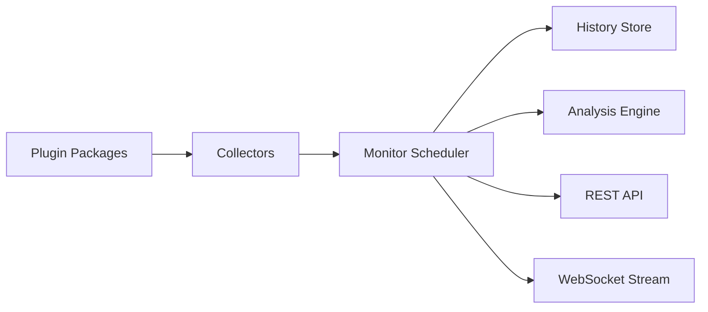

# Midnight LLM Monitor

Midnight LLM Monitor is a lightweight hardware intelligence daemon for machines running local LLM servers such as Ollama, llama.cpp, and vLLM-adjacent tooling.

It exposes live metrics over REST and WebSocket so Midnight Coder can make decisions from real hardware state instead of guesses.

## Install

```bash
npm install -g midnight-monitor
```

Run without installing:

```bash
npx midnight-monitor
```

## CLI

```bash
midnight-monitor
midnight-monitor start
midnight-monitor stop
midnight-monitor status
midnight-monitor doctor
midnight-monitor benchmark
```

## Configuration

Create `midnight-monitor.config.json` in the working directory.

```json
{
  "server": {
    "host": "127.0.0.1",
    "port": 9898,
    "wsPath": "/ws"
  },
  "collectors": {
    "enabled": ["cpu", "ram", "swap", "gpu", "disk", "network", "temperatures", "processes", "ollama", "llamacpp", "history"],
    "modules": []
  },
  "intervals": {
    "cpu": 1000,
    "ram": 1000,
    "swap": 1000,
    "gpu": 1000,
    "disk": 10000,
    "temperatures": 5000,
    "network": 1000,
    "processes": 1000,
    "ollama": 2000,
    "llamacpp": 2000,
    "history": 1000
  }
}
```

## REST API

- `GET /` dashboard web
- `GET /health`
- `GET /metrics`
- `GET /cpu`
- `GET /memory`
- `GET /swap`
- `GET /gpu`
- `GET /disk`
- `GET /network`
- `GET /ollama`
- `GET /history`
- `GET /processes`

Example:

```bash
curl http://127.0.0.1:9898/metrics
```

## WebSocket

Connect to `/ws` for live updates.

```js
const socket = new WebSocket("ws://127.0.0.1:9898/ws");
socket.onmessage = (event) => {
  console.log(JSON.parse(event.data));
};
```

## Web Monitor

Abra `http://127.0.0.1:9898/` para ver o painel visual com:

- resumo de CPU, RAM, swap, GPU, VRAM, disco, rede e temperatura
- histórico em tempo real
- modelos Ollama em execução e instalados
- processos mais pesados
- alertas de análise com cores por severidade

## Example payload

```json
{
  "timestamp": "2026-07-17T12:00:00.000Z",
  "cpu": { "usage": 32, "cores": 8 },
  "ram": { "usedBytes": 123456789, "totalBytes": 17179869184 },
  "swap": { "usedBytes": 0, "totalBytes": 34359738368 },
  "gpu": {
    "vendor": "NVIDIA",
    "model": "RTX 4090",
    "usagePercent": 91,
    "temperatureCelsius": 72,
    "vram": { "usedBytes": 21500000000, "totalBytes": 25769803776 }
  },
  "ollama": { "running": [], "installed": [] },
  "analysis": []
}
```

## JSON Schemas

### CpuMetrics

```json
{
  "usage": "number",
  "cores": "number",
  "threads": "number",
  "loadAverage": "[number, number, number]",
  "frequencyMhz": "number",
  "uptimeSeconds": "number"
}
```

### GpuMetrics

```json
{
  "vendor": "string",
  "model": "string",
  "usagePercent": "number | null",
  "temperatureCelsius": "number | null",
  "vram": {
    "totalBytes": "number | null",
    "usedBytes": "number | null",
    "freeBytes": "number | null"
  }
}
```

## Architecture



## Collector plugins

Collectors are discovered from the built-in `src/collectors/` directory and can also be loaded from installed npm packages.

Each collector implements:

```ts
initialize(context)
collect(context)
health()
dispose()
```

Third-party packages can export a `createCollector`-style factory and be enabled in `midnight-monitor.config.json`.

## Contributing

1. Fork or branch.
2. Run `npm install`.
3. Use `npm run typecheck`, `npm run lint`, and `npm test`.
4. Keep collectors isolated and failure-tolerant.
5. Include tests for parsing and analysis changes.
